# VscodeのRemote Devlopmentを使ってPython開発環境を作る
## VscodeのRemote Devlopmentとは
ローカルPCのエディタ(VS code)を使って、リモートサーバー/コンテナー上で開発ができるVS Codeの拡張機能のこと。

開発環境は外部のサーバーやコンテナに分離し、ローカルにあるVS Codeをそのまま使用できる。
→ VS Codeが持つ様々な機能(debugとか、拡張機能...等)をそのまま使える。

## リモートへの接続タイプ
以下の２種類ある (Remote WSLもあるが、ここでは割愛)
### Remote SSH

ローカルPCからリモートサーバーにssh接続する。ローカルPCのVS Codeからリモートサーバー上のファイルをいじれる。リモートサーバーに特別な設定せずに、ローカルPCのVS Codeを使って、debug等ができる。


(https://code.visualstudio.com/docs/remote/ssh 公式サイトから引用)


### Remote Container

ローカルOS上のコンテナ、またはリモートサーバー上のコンテナに接続する。
devcontainer.jsonに開発に使用するDockerfile(docker-compose.yml), VS Codeの設定や拡張機能を定義することで、**開発環境のコード化**ができる。


(https://code.visualstudio.com/docs/remote/containers 公式サイトから引用)

<br>

## Remote Devlopmentのメリット
* ローカルPCを汚染せず、環境構築ができる。
* リモートサーバーを使用する場合、外部のリソースを使うのでハイスペックなローカルPCが不要。
* 開発環境の共有が簡単
→devcontainer.jsonを共有することで、同一の開発環境を容易に構築できる。  
↓こんな感じでvscodeの設定や拡張機能も簡単に共有できる

```json
{
	"name": "Existing Dockerfile",
	"context": "..",
	"dockerFile": "../Dockerfile.dev",
	"customizations": {
		"vscode": {
			"settings": {
				"python.linting.pylintEnabled": false,
				"python.linting.pep8Enabled": false,
				"python.linting.flake8Enabled": true,
				"editor.defaultFormatter": "ms-python.black-formatter",
				"editor.formatOnSave": true,
				"python.linting.flake8Args": [
					"--max-line-length=88",
					"--ignore=E402, D100, D202"
				  ]
			},
			"extensions": [
				"ms-python.python",
				"ms-python.vscode-pylance",
				"ms-python.black-formatter",
				"eamodio.gitlens",
				"mhutchie.git-graph"
			]
		}
	}
}

```

<br>


## Remote Devlopmentのデメリット
* エディタがVS Codeに制限される。
* ローカルOS上のコンテナに接続して開発する場合、それなりのスペックの作業PCが必要。
* Remote SSH の場合、通信環境が不安定だと頻繁に接続が切れる。

<br>

## Remote Devlopmentを使うのに必要な拡張機能
```
・Remote Development
Extention_ID: ms-vscode-remote.vscode-remote-extensionpack
```
- Remote Developmentをインストールすると、以下の3つの拡張機能がインストールされる)
```
・Remote - Containers  
Extention_ID: ms-vscode-remote.remote-containers

・Remote - SSH  
Extention_ID: ms-vscode-remote.remote-ssh

・Remote - WSL  (WindowsかつWSLを使う場合に必要)
Extention_ID: ms-vscode-remote.remote-wsl

```

<br>

## Remote SSHの使い方
### Remote SSHの要件
(公式サイトより引用)  
https://code.visualstudio.com/docs/remote/ssh
> ### System requirements  
> **Local**: A supported OpenSSH compatible SSH client must also be installed.  
> 
> **Remote SSH host**: A running SSH server on:
> 
> - x86_64 Debian 8+, Ubuntu 16.04+, CentOS / RHEL 7+.
> - ARMv7l (AArch32) Raspberry Pi OS (previously called Raspbian) Stretch/9+ (32-bit).
> - ARMv8l (AArch64) Ubuntu 18.04+ (64-bit).
> - Windows 10 / Server 2016/2019 (1803+) using the official OpenSSH Server.
> - macOS 10.14+ (Mojave) SSH hosts with Remote Login enabled.
> - 1 GB RAM is required for remote hosts, but at least 2 GB RAM and a 2-core CPU is > recommended.
> 
> Other glibc based Linux distributions for x86_64, ARMv7l (AArch32), and ARMv8l > (AArch64) should work if they have the needed prerequisites. See the Remote Development > with Linux article for information prerequisites and tips for getting community > supported distributions up and running.
> 
> While ARMv7l (AArch32) and ARMv8l (AArch64) support is available, some extensions > installed on these devices may not work due to the use of x86 native code in the > extension.

### VS Codeからリモートサーバーにsshで接続する
1. CMD(Ctrl) + shift + p でコマンドパレットを開く

2. Remote-SSH: Connect to Host... を選択する
<!-- 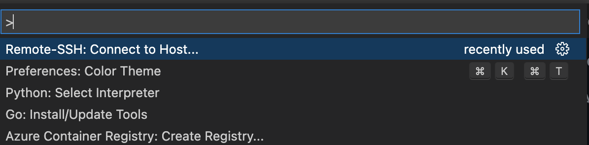 -->

<br>

3. Add New SSH Hosts...  を選択し、ssh接続コマンドを入力する  
<!-- 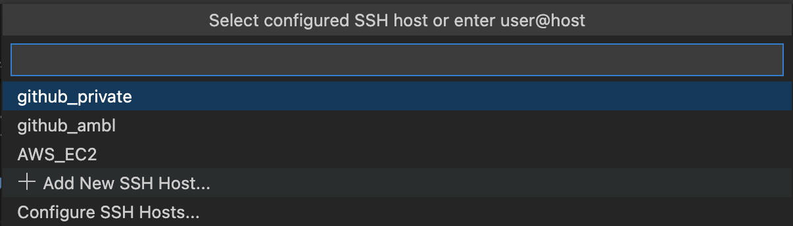 -->


<br>

- ssh接続コマンドを入力する  
(例) ```ssh -i "test.pem" username@test.com -A```
<!-- 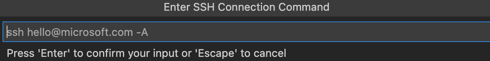 -->


<br>

4. sshの設定を保存するファイルを選択する  
ファイルを選択すると、自動的にsshの接続情報が登録される
<!-- 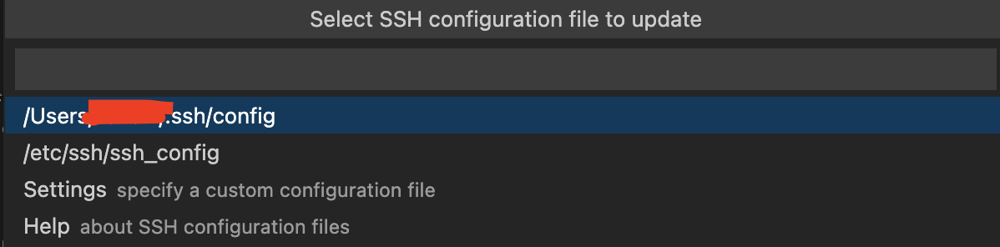 -->


<br>

5. 再度、CMD(Ctrl) + shift + p 推して、Remote-SSH: Connect to Host...  を選択すると、先ほど追加したsshホストが出てくるので選択する
<!-- 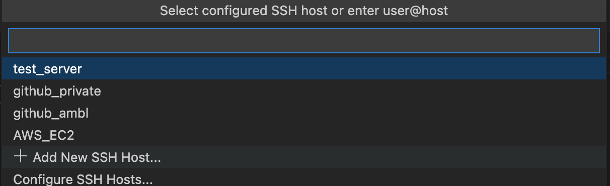 -->


<br>

6. 新しいVS Codeのウィンドウが立ち上がるので、リモートサーバー上のプロジェクトフォルダを選択する
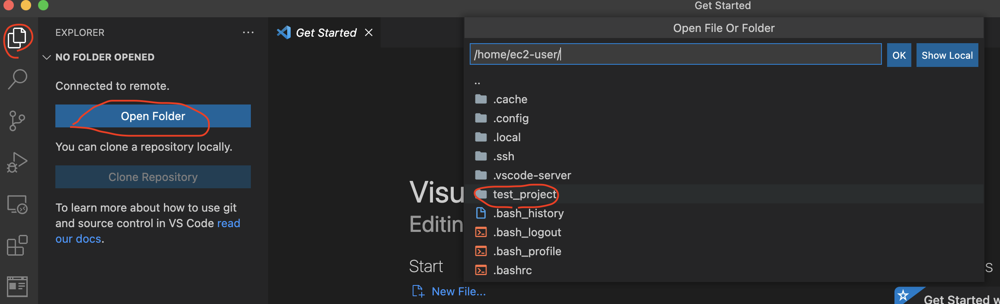
<!--  -->


7. あとは必要な拡張機能をインストールし、開発を行う

### 補足
コマンドパレット(CMD(Ctrl) + shift + p )を使わなくても、左のメニューのRemote Explorerから同じことができる
<!-- 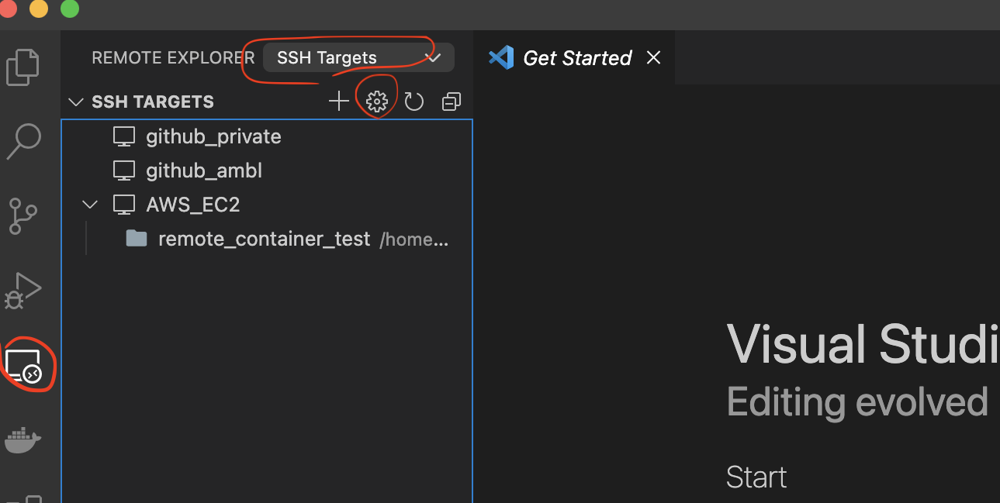 -->


<br>

## Remote Containerの使い方
### Remote Containerの要件
(公式サイトより引用)  
https://code.visualstudio.com/docs/remote/containers
> ### System requirements
> **Local / Remote Host**:
> 
> - **Windows**: Docker Desktop 2.0+ on Windows 10 Pro/Enterprise. Windows 10 Home (2004+) requires Docker Desktop > 2.3+ and the WSL 2 back-end. (Docker Toolbox is not supported. Windows container images are not supported.)
> - **macOS**: Docker Desktop 2.0+.
> - **Linux**: Docker CE/EE 18.06+ and Docker Compose 1.21+. (The Ubuntu snap package is not supported.)
> - **Remote hosts**: 1 GB RAM is required, but at least 2 GB RAM and a 2-core CPU is recommended.
>
> Other Docker compliant CLIs may work, but are not officially supported. Note that attaching to a > Kubernetes cluster only requires a properly configured kubectl CLI.
> 
> **Containers**:
> 
> - x86_64 / ARMv7l (AArch32) / ARMv8l (AArch64) Debian 9+, Ubuntu 16.04+, CentOS / RHEL 7+
> - x86_64 Alpine Linux 3.9+
>
> Other glibc based Linux containers may work if they have needed Linux prerequisites.


### VS Codeからコンテナーに接続する
- 今回使用する構成
```
remote_container_test/
├── Dockerfile
└── src
    └── test.py
```
- Dockerfile
```Dockerfile
FROM alpine
RUN apk --no-cache add python3
```
- test.py (debug確認用)
```python
import platform


def test() -> str:
    platform_information = platform.platform()
    return f"platform : {platform_information}"

if __name__ == "__main__":
    print(test())
```

1. CMD(Ctrl) + shift + p  でコマンドパレットを開く

2. Remote-Containers: Reopen in Container  を選択する
<!-- 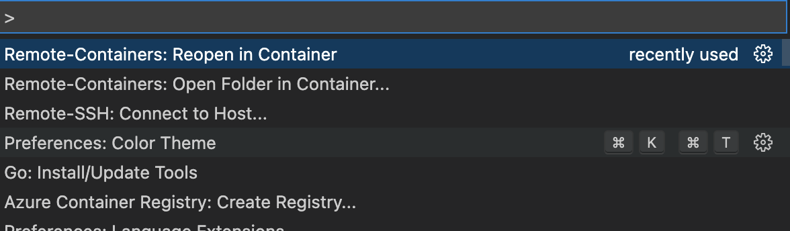 -->


<br>

3. どのDockerfile(またはdocker-compose.yml)を使うか聞かれるので、開発で使うDockerfile(またはdocker-compose.yml)を指定する
<!-- 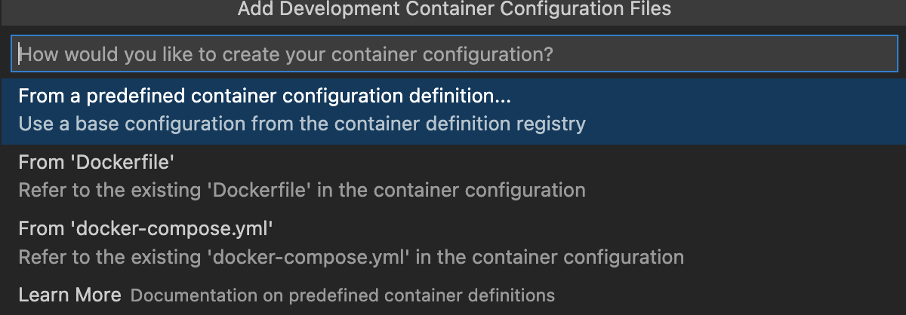 -->


<br>

- 今回はDockerfileなので聞かれないが、docker-compose.ymlを選択した & docker-compose.ymlに複数サービスが定義してある場合は、どのサービスを使うか聞かれるので開発を行うサービスを選択する

<!-- 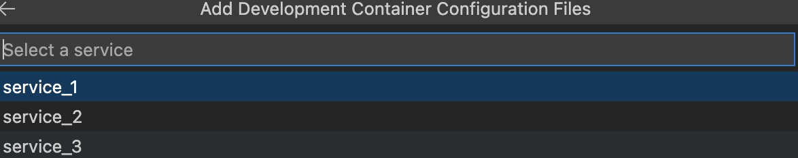 -->


<br>

4. Dockerfileを選択すると、プロジェクトディレクトリ直下に ```.devcontainer/devcontainer.jsonが``` 生成され、Dev ContainerでVS Codeが立ち上がる
<!-- 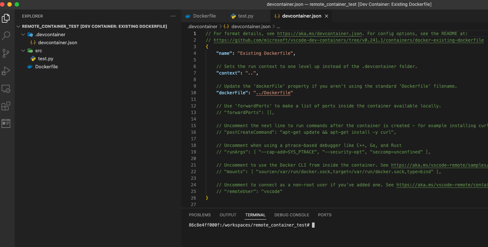 -->


5. あとは必要な拡張機能をインストールし、開発を行う  
※ Local PCのVS Codeに既に拡張機能が入ってても、Remote Container(Remote SSHでも同様)の方でも拡張機能を新たにインストールする必要があるので注意。
 いちいち手動で拡張機能をインストールするのが面倒くさい場合は、以下のように```devcontainer.json```のextensionsのところに、拡張機能のExtension IDを書いておくと良い。

```json
{
	"name": "Existing Dockerfile",
	"context": "..",
	"dockerFile": "../Dockerfile.dev",
	"customizations": {
		"vscode": {
			"settings": {
				"python.linting.pylintEnabled": false,
				"python.linting.pep8Enabled": false,
				"python.linting.flake8Enabled": true,
				"editor.defaultFormatter": "ms-python.black-formatter",
				"editor.formatOnSave": true,
				"python.linting.flake8Args": [
					"--max-line-length=88",
					"--ignore=E402, D100, D202"
				  ]
			},
			"extensions": [    ★ここのリストに必要な拡張機能(Extension ID)を入れておく
				"ms-python.python",
				"ms-python.vscode-pylance",
				"ms-python.black-formatter",
				"eamodio.gitlens",
				"mhutchie.git-graph"
			]
		}
	}
}

```

### debugしてみる
以下のように、コンテナ内のpythonファイルをデバッグもできる  
(Dev Containerにpythonの拡張機能(ms-python.python)を入れる必要あり)
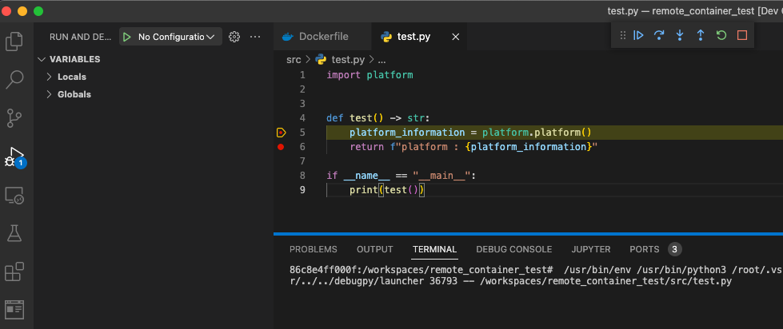

### 補足
こちらも同様に、コマンドパレット(CMD(Ctrl) + shift + p )を使わなくても、左のメニューのRemote Explorerから同じことができる

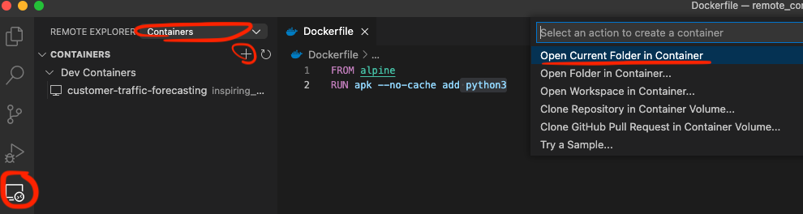

## まとめ

- Remote SSHはリモート環境にあるファイルを、ローカルPCのVS Codeを使って操作できるので便利  
(リモートのサーバーにエディタを入れる必要ない)
- Remote Containerは、VS Codeを開発者全員が使用しているなら非常に有用


以上、VS CodeのRemote Developmentの機能について、基礎的な使い方を記載させていただきました。
